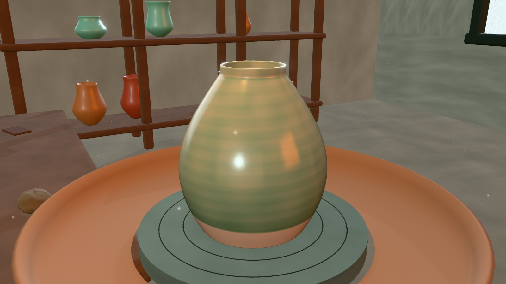
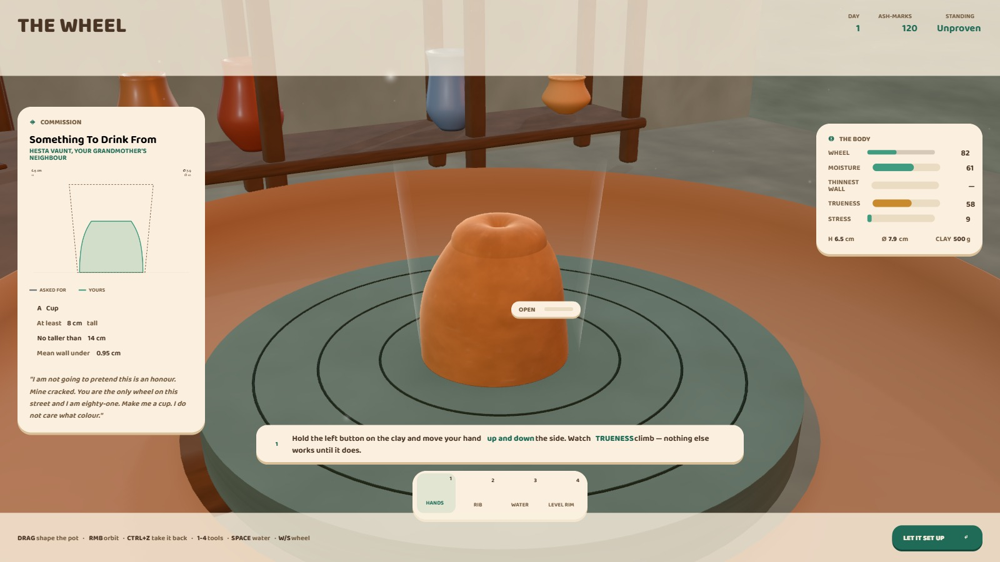
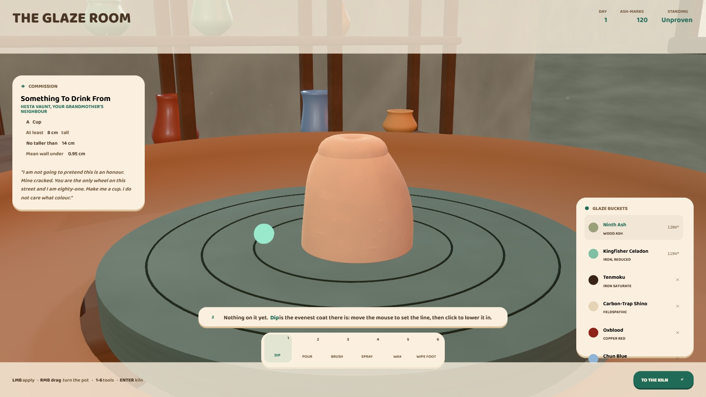
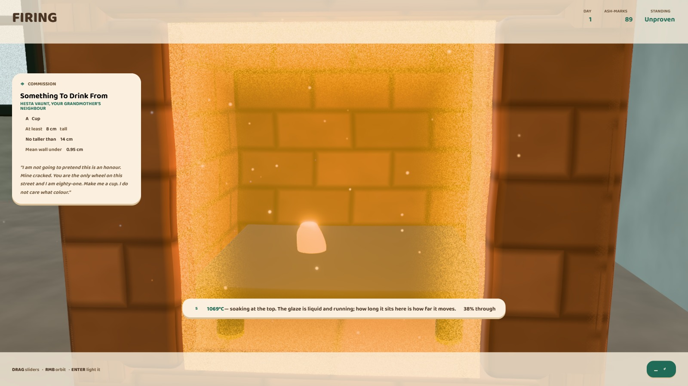
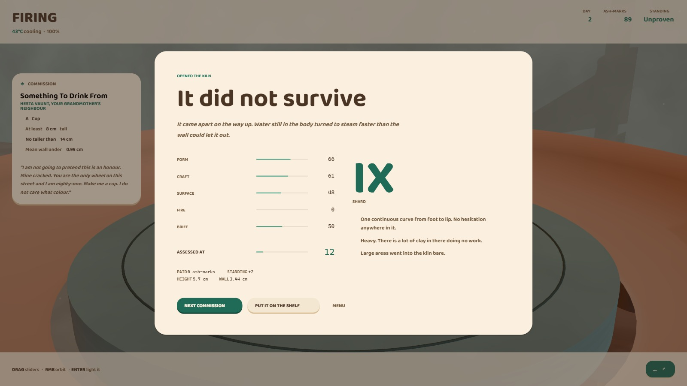

<div align="center">

<h1>CELADON</h1>
<h3>The Long Ash</h3>

<p>
  <em>A 3D pottery game with nothing in it but code.</em><br>
  Throw a pot on a wheel, dry it, trim a foot, glaze it, fire it —<br>
  and then find out what the kiln decided to do with it.
</p>

<p>
  
  
  
</p>

<p>
  <a href="https://winchxyz.github.io/celadon/"></a>
</p>

<p>
  <a href="LICENSE"></a>
  
  
  
  
  
  
</p>



</div>

---

Nine winters ago the mountain called Ivorine opened along its whole length and
did not stop. What came out was not lava; it was ash, and it is still coming.
The only reliable heat left in the world is in the kilns of the Ember Guild.
You have your grandmother's wheel, her kiln, and her mark — and not yet the
right to use it.

There is one mercy in it. Sieved and washed, the ash that is killing the Reach
is the finest glaze flux anyone has ever fired.

**Nothing here is an art asset.** The clay, the glaze chemistry, the kiln, every
texture in the room, every surface, the environment map and every note of the
music are computed on your machine at load. The only files the game fetches are
nine small CC0 sound recordings — about 140 kB — and it runs without them.

---

## Look at it

|  |  |
|:--:|:--:|
|  |  |
| **The wheel** — one control, four strokes. The panel on the left draws what you were asked for; get your shape inside it. | **The glaze room** — twelve recipes, defined by chemistry rather than by colour. |
|  |  |
| **The firing** — forty hours in forty seconds, narrated, because everything that matters in a kiln is invisible. | **Opening the kiln** — graded on Form, Craft, Surface, Fire and Brief, and told exactly what it thought. |

---

## Running it

It is already running at **[winchxyz.github.io/celadon](https://winchxyz.github.io/celadon/)** —
no install, nothing to download. Every push to `master` rebuilds it, and the
twenty-one benches have to pass before it deploys.

To run it locally:

```bash
npm install
npm run dev      # http://localhost:5180
```

```bash
npm run build && npm run preview   # production bundle
npm test                           # twenty-one headless benches, ~10 s
```

**Requirements:** a browser with WebGL2 and hardware acceleration — recent
Chrome, Edge, Firefox or Safari.

---

## Playing

**There is one control.** Hold the left mouse button on the clay and move
your hand. What happens depends on which way you drag, exactly as it would at
a real wheel — and the label beside your hand always names what you are doing.

| drag | what it does |
|---|---|
| **up** | lifts the wall and thins it — this is how a pot gets tall |
| **down** | presses it back down: shorter, and thicker |
| **sideways, outward** | bellies it out: wider, and shorter |
| **sideways, inward** | collars it in: narrower, and taller |
| **down the middle of the top** | opens the floor |
| **side to side on a closed lump** | centres it |

Four strokes, and each one undoes its opposite. That matters more than it
sounds: without the downward stroke every move a player could make grew the
pot or widened it, and a piece that had gone too tall could only be rescued by
bellying it out — if it was already wide enough, there was nothing to do but
start again.

You take hold of the wall and carry it. Where you grab does not matter, only
how far you drag; and a stroke does the thing it is *mostly* doing, so a
widening drag that wanders a few degrees off horizontal still widens instead
of quietly gaining height. Which way is "up" and which is "outward" is read
off the screen where you made the stroke, so it means the same thing from
every camera angle.

How far you drag is what counts, never how fast. A slow, careful pull moves
exactly as much clay as a quick one. Your hand snaps to the wall, so you do
not have to aim: being two or three centimetres out costs you almost nothing.
The drag is low-passed, so a hand that is not perfectly steady still means one
thing rather than cancelling itself out.

The panel on the left draws the shape you were asked for as a dashed outline
with the shape on your wheel over the top of it. Get one inside the other.
A single line at the bottom of the screen always tells you the one thing to do
next.

| | |
|---|---|
| **Drag** | shape the clay — the only thing your hand ever does to the pot |
| **Right-drag** | orbit — except in the glaze room, where it turns the pot on its banding wheel |
| **Scroll** | wheel speed at the wheel · a six-degree nudge in the glaze room · zoom with **Shift** |
| **Ctrl+Z** | take back the last few seconds — use it freely |
| **1 – 4** | hands · rib · water · needle |
| **Space** | water · **W** / **S** wheel speed |
| **Tab** | stress view · **G** target ghost |
| **Enter** | next stage · **Esc** menu |

On a tablet there is no right button and no scroll wheel, which is two of the
three things the game is steered with. So the fingers split the job: **one
finger only ever touches the clay**, and **two fingers** carry everything else
— drag them to orbit, pinch to zoom, and in the glaze room turn the pot on its
banding wheel. Holding a tool shows what it does in the line under the stage
name, and every kiln slider explains itself when you touch it.

With the assist on — which it is by default — the wheel is already turning
when you sit down, the clay dries slowly, and a pot that is getting away from
you stops growing and says so instead of folding up without warning. Turn it
off and you get the full simulation: clay that dries under your hands, a wheel
you have to manage yourself, and no second chances.

### Two kilns

A firing is six controls, and five of them can ruin a pot in ways nothing
tells you about until the kiln is opened a day later. The one that matters
most has to land within about 25 °C of a number that is a property of a glaze
you chose an hour ago. That is a fine thing to want and a poor thing to be
handed by default, so it is a choice, made in the kiln itself:

| | |
|---|---|
| **The Guild fires it** | a kiln master sets the schedule for the glazes actually on your pot — hot enough to bring every one to a glass, climbing no faster than the wall you threw can take, in the air the letter asked for. It comes out fired. What it *looks* like is still down to how you threw it and how you glazed it. |
| **I fire it** | all six controls, and every way to lose it. Peak, ramp, soak, reduction, when the damper shuts, and how it cools. |

The Guild has it unless you say otherwise.

## What is actually being simulated

### The clay

The vessel lives in *material coordinates*: it is divided into 168 stacked
ring-sections, each holding a fixed volume of clay, described by an inner and
an outer radius. Its height follows from mass conservation:

```
A[i]  = PI * (ro^2 - ri^2)        cross-section area
dy[i] = V[i] / A[i]               section height
```

Every rule a potter knows falls out of that one identity, without being
written down anywhere:

* thinning a wall shrinks `A`, so the pot **grows taller**
* bellying out from inside grows `A`, so it gets **shorter and wider**
* collaring in shrinks `A`, so it **rises again**
* no tool can create or destroy clay

All the shaping lives in `sim/hand.js`, apart from the game loop, because the
benches drive that object directly: what is tested is what runs.

The hand works in those same material coordinates: a drag is converted into
*work* by its length, not its speed, so the tool responds to how far you moved
rather than how fast your mouse happened to be going. A hand in the upper part
of the pot carries the clay above it, because a pot grows upward faster than
anyone can drag and otherwise every piece keeps a heavy collar at the rim that
there is no way to reach.

Around that sit the things that make throwing hard: moisture (peak workability
around 55%, weak when sodden, tearing when dry), centrifugal hoop stress
scaled by how far a thin wall can deflect, the compressive load of the column
above, plastic slumping past a yield point of roughly 18 kPa, off-centre
wobble that feeds on its own momentum, and tearing below a 0.85 mm wall.

A pot can fail in four ways, all of them emergent: it can slump when it is too
wet, tear when it is too thin, walk off the wheel head when it was never
centred, or simply grow past what wet clay can hold.

### The glaze

A glaze is a glass that has not been melted yet. Twelve recipes are defined by
chemistry — flux, silica, alumina, and colourants — and four things decide
what comes out of the kiln:

1. the recipe
2. how thickly it went on
3. how hot the kiln got and for how long
4. whether the kiln had enough air

Copper is a green leaf in air and the colour of a wound when starved of it.
Iron at two parts in a hundred is honey in oxidation and, in reduction, the
colour of shallow sea water — that colour is called celadon, and it is what
the game is named for. At ten parts it stops being a colour and becomes a
depth.

**Twelve glazes, three at a time.** You start with two — Ninth Ash and
Kingfisher Celadon — and the other ten arrive one per commission, so the
campaign is also how you fill the shed. In the open shed all twelve are on the
shelf from the first minute.

A single pot carries **three** of them, because the field below is an RGBA
texture and its three colour channels are the three coat thicknesses. Opening
a bucket to see what the colour is costs nothing; painting with it takes a
layer. Once all three have been used the shelf greys out the rest, and the
game will not quietly wash one off to make room — the glaze room has no undo,
so a fourth glaze is refused rather than granted at the expense of work you
have already done.

Glaze lives in a 2D field wrapped around the pot (192 × 160 cells, three
layers plus a wax-resist mask). During the firing it is integrated forward in
time and molten glaze flows downhill at a rate set by `h³ / viscosity` — which
is why a thick coat runs, a thin one does not, and the runs always start where
the wall is steep. If it reaches the foot, the pot welds itself to the shelf
and comes out in pieces.

On the fired surface, colour comes from Beer–Lambert absorption through the
glass layer, so a thick coat goes deep and a thin one stays pale, and the
glaze breaks to a different colour over every ridge and rim. Crystals nucleate
only where there is enough glass to grow in.

Crazing comes from the expansion mismatch between the glaze and **the clay
underneath it** — which is the one property of a body a fired pot shows most
plainly, and which the firing ignored for a long time in favour of a flat
constant. Each body declares its own: Blackhill 6.0, Ashstone 6.4, Saltflat
6.6, Reach Porcelain 6.9. A glaze that contracts more than its body ends up in
tension and lets go in a net of cracks; one that contracts less is squeezed and
holds. So Reach Porcelain puts a celadon into compression and it comes out of
the kiln with no craze at all, which is exactly why those two have been fired
together for a thousand years — and Blackhill crazes things Ashstone leaves
alone.

### The kiln

You set the ramp rate, peak temperature, soak, reduction, when the damper
closes, and how it cools. Then you watch about forty hours pass in forty
seconds, with the pot glowing at its blackbody colour on the shelf.

Ramp too fast for the wall thickness and it comes apart on the way up.
Crash-cool a heavy wall and it dunts. Start reduction before the body has
burned clean and it bloats. Hold between 1120 °C and 1030 °C for long enough
and zinc silicate stops pretending to be a glass and opens into flowers.

Firing costs fuel, and fuel costs ash-marks, so every schedule is a bet.

---

## The rest of it

**Twenty-four story commissions** with named patrons, then endless standing
orders. Every glaze in the game is asked for by name at some point, every form
including the plate, and every clay body: a brief can tell you which clay to
throw in, which is what a client who wants a translucent white plate is
actually doing. The standing orders that follow the campaign start near where
it left off rather than at a tenth of it, and they can ask for an atmosphere,
a clay or an effect — but only for an effect the glaze they name can actually
produce.

**You buy the clay.** Every body has a price and it is charged by weight when
you sit down with the ball, so the weight slider is a decision about money as
well as size. Four clay bodies, twelve glazes and a handful of tools unlock as
your standing rises. Every piece that survives goes on **the shelf**; every
commission and every mistake adds a fragment to **the codex**. It all saves to
`localStorage` — and an old save comes back to the job it was on, even though
the campaign has since doubled in length under it.

Pieces are graded out of a hundred on Form, Craft, Surface, Fire and Brief,
and the appraisal tells you exactly what it thought — including when the thing
that happened was better than the thing you asked for.

**The open shed** is the campaign with the scoring apparatus switched off: the
same wheel, the same kiln, every glaze unlocked, no brief to satisfy, no fee,
and no wood to pay for. What matters about it is what it does *not* do — it
never writes to your save, and `src/dev/freemode.mjs` snapshots nine fields of
the campaign, runs a whole firing, and fails if any of them moved.

---

## How it is built

No engine, no assets, no network. Three.js for the WebGL2 plumbing and its PBR
material, and everything else is here.

```
src/
  core/      util.js       maths, noise, deterministic RNG, blackbody
             engine.js     renderer, camera rig, post chain, procedural IBL
  sim/       clay.js       the clay body: tools, stress, moisture, failure
             glaze.js      recipes, melt chemistry, the firing
             glazeField.js application, coverage and molten flow
  render/    potMesh.js    the GPU lathe and its profile texture
             potMaterial.js the ceramic shader
             studio.js     the workshop, the kiln, the light
             palette.js    every colour in the game, and nowhere else
             textures.js   every surface in the room, generated at load
             glsl.js       shared shader library
  game/      game.js       state machine and input
             lore.js       the world, the forms, the commissions
             scoring.js    the appraiser
             save.js       persistence
  ui/        hud.js  style.css
  audio/     audio.js      WebAudio: CC0 recordings over a synthesised fallback
```

**The pot is revolved on the GPU.** Nothing about its shape lives in the
vertex buffer. Every frame the CPU writes a 349 × 4 RGBA float texture
describing the current meridian — radius, height, normal, off-centre offset,
throwing-ring amplitude, moisture, damage, stress — and the vertex shader
sweeps it into 45,000 vertices. Updating a pot costs about 350 texel writes
instead of 45,000 vertex writes, which is what makes a fully simulated,
continuously deforming vessel affordable at 60 fps.

The environment map is a PMREM prefilter of a tiny procedural scene: an ash
sky, a cold window, the kiln mouth, and a warm bounce off the brick. That is
where the glaze reflections come from.

The post chain is render → bloom → grade → Neutral tone mapping → SMAA. It
used to be longer. Ambient occlusion, chromatic aberration, a vignette and
film grain were all in it and all came out, because each of them is a fact
about a *camera* and there is no camera in this game — a lens falls off at its
edges and a clay set does not. What the grade pass still carries is the heat
shimmer off the kiln and the fade between stages. If the frame rate cannot
hold, antialiasing goes first and then the pixel ratio, automatically.

Tone mapping is Neutral rather than ACES for a measurable reason. Neutral
subtracts an offset derived from the *minimum* channel of each pixel, which
means it makes dark colours **more** saturated, not less — so an attempt at a
moody, dimly lit room comes back as mud however carefully it is lit. The room
is keyed high instead, and `src/dev/heat.mjs` pins the one place that still
has to survive the shoulder: a pot glowing at 1069 °C.

Nothing in the room is an image file. Plaster, brick, wood, stone, metal and
cloth are each written as a pixel function that returns colour, height and
roughness; the height field is run through a Sobel filter to make a
tangent-space normal map. The noise underneath is periodic, so the tiles
actually close — without that, a small texture repeated seven times across a
five-metre floor rules a visible grid across it.

Those six mixes are all **grey**. Every colour in the game lives in
`render/palette.js` and nowhere else. It got that way after an audit found
eighteen separate browns in the room — not a palette, one swatch dragged up
and down a lightness slider, which is arithmetically why the frame read as
mud. The mixes now carry structure only: the size of the mark, how thoroughly
a thumb went over it, how much unmixed pigment shows. A material that is given
a map but no colour throws, because with grey mixes it would silently render
white — which is exactly how the floor once became a sheet of blown paper.

Sound comes from two places, and the split is deliberate.

The wheel, the kiln, the room and the one-shots are **recordings** — all CC0,
listed with their sources in `public/sfx/CREDITS.md`. A motor, a fire, a room
and a click are fixed sounds, and synthesising them only ever produced an
impression of one. The wheel in particular used to be a sawtooth and a square
through a filter ringing at Q 3.2, which is a shape of sound that does not
occur anywhere in a pottery.

The clay under your hand is still synthesised, and should stay that way: it
has to answer continuously to how hard you are pressing, how fast the wheel is
turning and how wet the pot is, and a recording has one texture. Likewise the
music — three detuned triangles and an FM bell that rings on a pentatonic
every so often. If the recordings are missing or will not decode the game logs
it once and carries on with a synthesised set that still covers everything.

---

## Checking it without a GPU

Most of what makes this game hard to get right is in the simulation, not the
renderer, so nearly all of it can be tested headlessly.

```bash
npm test          # all twenty-one, about ten seconds
```

They fall into four groups.

**Does it run, and does it play?**

| bench | what it holds down |
|---|---|
| `loadcheck` | every module imports cleanly |
| `gametest` | the **real `Game`**, driven by mouse positions solved against the game's own screen-to-clay mapping |
| `winnable` | every campaign brief, played with deliberately imprecise hands, following the coach's own advice |
| `freemode` | the open shed writes nothing to the campaign save |

`gametest` is the important one: everything else is a simulation bench, and a
simulation bench can pass while the game itself misbehaves. For a while one did.

**Does the clay behave?**

| bench | what it holds down |
|---|---|
| `idle` | the failure modes, not the happy path — holding the button still does not grow the pot, a piece left turning does not bend itself, a solid lump cannot be stretched into a tower |
| `handtest` | a slow drag and a fast one along the same path do the same work (within 5%), and being three centimetres off the wall still gets 90% of the lift |
| `widen` | twelve honest widening attempts in a row, and the last four still have to be worth something — the answer to "it widens, then quietly stops paying out" |
| `bigger` | five different grips, deep in the bore to out in mid-air; every one must both widen and narrow |
| `crease` | a wall that has been creased can still be recovered |
| `camsweep` | the camera can see the whole pot from every angle it is allowed to reach |
| `controls` | how far the pot turns for a given hand movement, that it is the same at 30 fps and 144, and that a flick cannot run away |

**Is it put together properly?**

| bench | what it holds down |
|---|---|
| `solid` | nothing grows through anything else — pots on a shelf, the flywheel against the legs, the centring rings breaking the wheel head's surface rather than buried inside it |
| `seam` | the procedural tiles actually close, so no grid is ruled across the floor |
| `contrast` | every ink that colours type is readable on a cream plate, checked per CSS rule, with a lower bar granted only to `::before` glyphs |
| `heat` | the two blackbody curves — one in JavaScript lighting the kiln, one in GLSL glowing the pot inside it — still agree across 400–1400 °C |
| `encoding` | every file is still clean UTF-8, and the characters the interface is drawn with are still in it. A shell that reads UTF-8 as ANSI once wrote three files back double-encoded, and a terminal shows the damaged file and the healthy one identically — so this reads bytes |
| `firing` | what each kiln promises. On the Guild's schedule every one of the twelve glazes reaches maturity, none is destroyed, no wall thickness is cracked by the ramp, the brief's atmosphere is honoured, and a new potter can pay for it on day one. And, so that the hard mode is still a hard mode, that firing it yourself 200° short still comes out a scab |
| `campaign` | the whole campaign walked in order from an empty save. Every brief asks for a glaze and a clay the player already has, every effect is one the kiln can produce, no brief fixes a temperature its own glaze cannot reach, the fee never falls away, the kiln can always be lit, and the last rank is not handed out in the first two thirds. It exists because three commissions in a row used to ask for a glaze they themselves unlocked — a fault of the ORDER, invisible in any one of them |
| `savemig` | an old save meeting a longer campaign. Progress is stored as a position in the list, so growing the list in the middle used to move everyone: a finished player was dropped back into the middle of the campaign. Nobody is sent back to a commission they have already done |
| `slots` | a pot carries three glazes. Opening a bucket to look costs nothing; painting with it costs a layer; and a fourth glaze is refused rather than granted at the expense of a layer already painted — which is what used to happen, silently, in a room with no undo |

**Does the money work?**

`economy` builds a real pot, fires it through the real `fire()` and appraises it
with the real `appraise()`, then walks the whole campaign. It exists because the
game shipped unplayable: the two glazes you start with mature at 1284 °C, which
cost 75 marks to reach, against a purse of 55. Every firing a new player could
afford lost money, and by the third commission the run was dead with no way to
earn. It now holds down that the first firing is affordable, that it pays for
itself, that no bad run can strand you below the price of the cheapest firing,
and that fuel is neither most of an early fee nor a rounding error on a late one.

Each of these was written after finding the bug it describes, and each was
checked by putting the bug back to confirm the test fails.

`uitest.html` renders the whole interface with a stub game and no WebGL, for
checking layout and the silhouette panel on machines without hardware
acceleration.

---

## Licence and credits

The code is **MIT** — see [`LICENSE`](LICENSE).

Two kinds of third-party file ship with it, and both are documented where they
sit rather than only here:

* **Sound** — nine recordings, about 140 kB, every one **CC0 1.0** (public
  domain). Each source page was read and its licence confirmed before the file
  was taken; the list, with links, is in
  [`public/sfx/CREDITS.md`](public/sfx/CREDITS.md). CC0 requires no
  attribution — it is recorded because the next person to touch that folder
  should be able to check.
* **Type** — Baloo 2 and Nunito, both under the **SIL Open Font License 1.1**.
  That licence requires its own text to travel with the font files, so it does:
  [`public/fonts/OFL-Baloo2.txt`](public/fonts/OFL-Baloo2.txt) and
  [`public/fonts/OFL-Nunito.txt`](public/fonts/OFL-Nunito.txt), with a summary
  in [`public/fonts/CREDITS.md`](public/fonts/CREDITS.md).

Everything else — every texture, every material, the environment map, the
glaze chemistry, the kiln, the music — is generated by the code in this
repository and has no third-party rights attached to it.

Three.js is MIT. Built with Claude Opus 5 in Ultracode mode.
